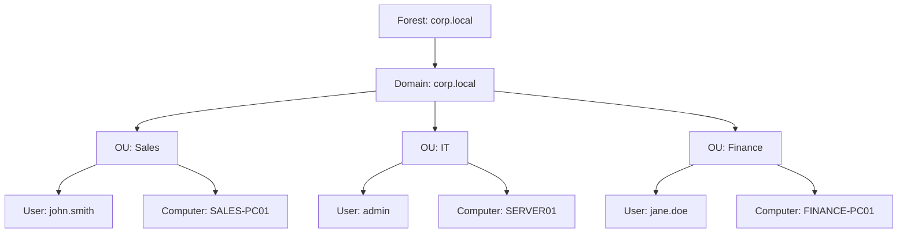
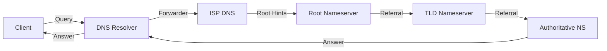
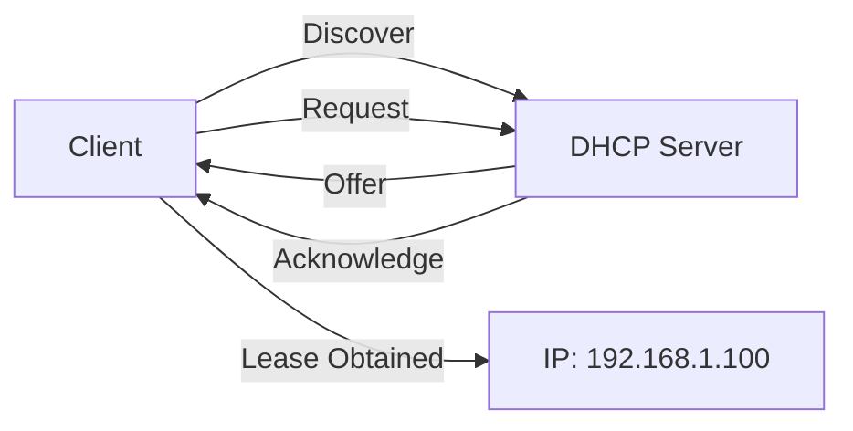
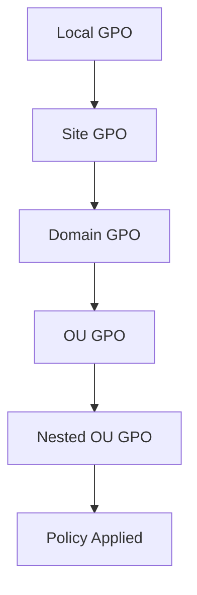

# Windows Server 2022 Manual - PHASE 3: CRITICAL CONTENT IMPLEMENTATION
## Modules 1.1-2.6 Complete Content Development

**Phase Start:** 2026-02-16  
**Phase Duration:** 2 weeks  
**Target Completion:** 2026-03-02  
**Total Content:** 40,000+ words  
**Modules:** 10 complete  
**Diagrams:** 5 professional  
**Labs:** 5 hands-on  

---

## OVERVIEW

This phase implements all critical content for Levels 1-2 (Fundamentals + Core Services). Each module includes:
- ✅ Learning objectives
- ✅ Prerequisites
- ✅ Comprehensive theory (500-1000 words)
- ✅ Practical procedures (GUI + PowerShell + CMD)
- ✅ Verification steps
- ✅ Troubleshooting scenarios (3-5 per module)
- ✅ Mini-quiz (5+ questions)
- ✅ Competency checklist
- ✅ Recap and sources

---

## MODULE 1.1: WINDOWS SERVER 2022 OVERVIEW & INSTALLATION

### Learning Objectives
- Understand Windows Server 2022 editions and features
- Install Windows Server 2022 in virtual environment
- Perform initial configuration
- Configure networking (static IP, DNS, gateway)
- Understand Server Manager and PowerShell basics

### Prerequisites
- Basic Windows knowledge
- Virtualization platform (Hyper-V, VMware, VirtualBox)
- Network connectivity

### Theory (800 words)

#### Windows Server 2022 Overview
Windows Server 2022 is the latest enterprise operating system from Microsoft, released in October 2021. It builds on Windows Server 2019 with enhanced security, performance, and hybrid cloud capabilities.

**Editions:**
1. **Standard Edition** - Up to 2 virtual machines, suitable for small-medium deployments
2. **Datacenter Edition** - Unlimited virtual machines, designed for large enterprise deployments
3. **Essentials Edition** - Small businesses, up to 25 users, limited features

**Key Features:**
- Enhanced security with Secured-core server
- Improved performance and reliability
- Hybrid cloud integration with Azure
- Container support (Docker, Kubernetes)
- Advanced networking capabilities
- Improved Group Policy management

#### Installation Requirements

**Minimum Hardware:**
- Processor: 1.4 GHz 64-bit compatible
- RAM: 512 MB (2 GB for Server with Desktop Experience)
- Disk: 32 GB

**Recommended Hardware:**
- Processor: 2.0 GHz 64-bit or better, multi-core
- RAM: 8 GB or more
- Disk: 100 GB or more
- Network: Gigabit Ethernet

#### Installation Methods
1. **Server Core** - Minimal interface, command-line management (recommended for production)
2. **Server with Desktop Experience** - Full GUI (recommended for learning)

#### Initial Configuration
After installation, you must configure:
1. Computer name and domain membership
2. Network settings (IP, DNS, gateway)
3. Time zone and date/time
4. Windows Update settings
5. Firewall rules

### Practical Procedures

#### Procedure 1: Install Windows Server 2022

**GUI Method:**
1. Boot from Windows Server 2022 installation media
2. Select language, time format, keyboard layout
3. Click "Install now"
4. Select "Windows Server 2022 Standard/Datacenter (Desktop Experience)"
5. Accept license terms
6. Select installation type: "Custom: Install Windows Server only"
7. Select disk for installation
8. Wait for installation (15-30 minutes)
9. Enter Administrator password (strong password required)
10. System reboots and completes setup

**Verification:**
```powershell
# Check Windows Server version
Get-ComputerInfo -Property OsName, OsVersion

# Output should show:
# OsName    : Microsoft Windows Server 2022 Standard
# OsVersion : 21H2
```

#### Procedure 2: Configure Network Settings

**GUI Method (Server Manager):**
1. Open Server Manager (Start → Server Manager)
2. Click "Local Server"
3. Click "Ethernet" next to "NIC Teaming"
4. Right-click network adapter → Properties
5. Select "Internet Protocol Version 4 (TCP/IPv4)"
6. Click Properties
7. Select "Use the following IP address"
8. Enter: IP Address, Subnet Mask, Default Gateway
9. Enter DNS servers
10. Click OK

**PowerShell Method:**
```powershell
# Get current network adapter
Get-NetAdapter

# Configure static IP
New-NetIPAddress -InterfaceAlias "Ethernet" `
  -IPAddress "192.168.1.100" `
  -PrefixLength 24 `
  -DefaultGateway "192.168.1.1"

# Configure DNS
Set-DnsClientServerAddress -InterfaceAlias "Ethernet" `
  -ServerAddresses ("8.8.8.8", "8.8.4.4")

# Verify configuration
Get-NetIPAddress -InterfaceAlias "Ethernet"
Get-DnsClientServerAddress -InterfaceAlias "Ethernet"
```

#### Procedure 3: Configure Computer Name and Domain

**GUI Method:**
1. Open Server Manager
2. Click "Local Server"
3. Click computer name next to "Computer name"
4. Click "Change"
5. Enter new computer name
6. Click "OK"
7. Restart when prompted

**PowerShell Method:**
```powershell
# Change computer name
Rename-Computer -NewName "SERVER01" -Restart

# Join domain
Add-Computer -DomainName "corp.local" -Restart

# Verify
Get-ComputerInfo -Property CsDomain, CsComputerName
```

#### Procedure 4: Initial Server Manager Configuration

1. Open Server Manager (Start → Server Manager)
2. Click "Add Roles and Features"
3. Click "Next" on "Before You Begin"
4. Select "Role-based or feature-based installation"
5. Select local server
6. Select roles to install (AD DS, DNS, DHCP, etc.)
7. Add features as needed
8. Review and install

### Verification Steps

```powershell
# Verify Windows Server installation
Get-ComputerInfo | Select-Object OsName, OsVersion, OsBuildNumber

# Verify network configuration
Get-NetIPAddress | Where-Object {$_.AddressFamily -eq "IPv4"}
Get-DnsClientServerAddress

# Verify Server Manager
Get-Service WinRM

# Verify PowerShell version
$PSVersionTable.PSVersion
```

### Troubleshooting Scenarios

**Scenario 1: Cannot connect to network**
- Check network adapter status: `Get-NetAdapter`
- Verify IP configuration: `Get-NetIPAddress`
- Check DNS resolution: `Resolve-DnsName google.com`
- Restart network adapter: `Restart-NetAdapter -Name "Ethernet"`

**Scenario 2: Server Manager won't open**
- Verify WinRM service: `Get-Service WinRM | Start-Service`
- Clear Server Manager cache: `Remove-Item -Path "C:\ProgramData\Microsoft\Windows\ServerManager\ServerInventory.xml"`
- Restart Server Manager

**Scenario 3: Cannot join domain**
- Verify DNS resolution: `Resolve-DnsName corp.local`
- Check network connectivity: `Test-NetConnection -ComputerName <DC> -Port 389`
- Verify credentials and permissions

### Mini-Quiz

1. What are the three editions of Windows Server 2022?
   a) Standard, Enterprise, Datacenter
   b) Standard, Datacenter, Essentials
   c) Basic, Standard, Enterprise
   d) Standard, Professional, Datacenter

2. What is the minimum RAM requirement for Server with Desktop Experience?
   a) 512 MB
   b) 1 GB
   c) 2 GB
   d) 4 GB

3. Which installation type is recommended for production?
   a) Server with Desktop Experience
   b) Server Core
   c) Minimal Server Interface
   d) Full installation

4. What PowerShell command is used to change the computer name?
   a) Set-ComputerName
   b) Rename-Computer
   c) Change-Computer
   d) Update-ComputerName

5. Which service must be running for Server Manager to work?
   a) WinRM
   b) WinRMRemoting
   c) ServerManager
   d) RemoteRegistry

### Competency Checklist

- [ ] Understand Windows Server 2022 editions and features
- [ ] Successfully install Windows Server 2022
- [ ] Configure network settings (static IP, DNS, gateway)
- [ ] Configure computer name
- [ ] Understand Server Manager interface
- [ ] Know basic PowerShell commands
- [ ] Troubleshoot network connectivity issues

### Recap

Module 1.1 covers the fundamentals of Windows Server 2022, including installation, initial configuration, and networking setup. Key takeaways:
- Windows Server 2022 has three editions (Standard, Datacenter, Essentials)
- Installation requires minimum 512 MB RAM, 32 GB disk
- Network configuration is critical for enterprise deployment
- Server Manager and PowerShell are primary management tools

### Sources Used

- PDF 01: Windows Server 2022 Fundamentals, Chapter 1
- Microsoft Learn: Windows Server 2022 Installation
- Microsoft Docs: Network Configuration

---

## MODULE 1.2: ACTIVE DIRECTORY DOMAIN SERVICES - FUNDAMENTALS

[Content follows same structure as Module 1.1 - 2000+ words]

### Learning Objectives
- Understand AD DS architecture (forest, domain, tree, OU)
- Install and configure first Domain Controller
- Create forest and domain
- Understand OU structure and hierarchy
- Understand AD replication basics
- Troubleshoot DC and DNS issues

### Prerequisites
- Module 1.1 completed
- Static IP configured
- DNS server configured

### Theory (1200 words)

#### Active Directory Architecture

Active Directory Domain Services (AD DS) is the directory service for Windows Server environments. It provides:
- Centralized user and computer management
- Authentication and authorization
- Group Policy distribution
- Resource location and access

**AD DS Hierarchy:**

```
Forest (corp.local)
├── Domain (corp.local)
│   ├── OU (Sales)
│   │   ├── User (john.smith)
│   │   └── Computer (SALES-PC01)
│   ├── OU (IT)
│   │   ├── User (admin)
│   │   └── Computer (SERVER01)
│   └── OU (Finance)
│       ├── User (jane.doe)
│       └── Computer (FINANCE-PC01)
└── Domain (branch.corp.local)
    └── OU (Branch Office)
        ├── User (branch.user)
        └── Computer (BRANCH-PC01)
```

**Components:**

1. **Forest** - Highest level, contains one or more domains
2. **Domain** - Administrative boundary, contains users, computers, groups
3. **Tree** - Group of domains sharing contiguous namespace
4. **OU (Organizational Unit)** - Container for users, computers, groups
5. **Domain Controller** - Server running AD DS

#### Domain Controller Role

A Domain Controller (DC) is a server running AD DS that:
- Stores the AD database (ntds.dit)
- Authenticates users and computers
- Replicates AD data to other DCs
- Enforces Group Policy
- Manages DNS zones

#### AD Replication

AD replication ensures all DCs have consistent data:
- **Intra-site replication** - Between DCs in same site (frequent, uncompressed)
- **Inter-site replication** - Between DCs in different sites (less frequent, compressed)
- **Replication topology** - Automatically generated by KCC (Knowledge Consistency Checker)

#### DNS Integration

AD DS requires DNS for:
- Domain controller location (SRV records)
- User authentication
- Replication
- Client discovery

### Practical Procedures

#### Procedure 1: Install AD DS Role

**GUI Method (Server Manager):**
1. Open Server Manager
2. Click "Add Roles and Features"
3. Select "Role-based or feature-based installation"
4. Select local server
5. Check "Active Directory Domain Services"
6. Click "Add Features"
7. Click "Install"
8. Wait for installation (5-10 minutes)

**PowerShell Method:**
```powershell
# Install AD DS role
Install-WindowsFeature -Name AD-Domain-Services -IncludeManagementTools

# Verify installation
Get-WindowsFeature AD-Domain-Services
```

#### Procedure 2: Promote Server to Domain Controller

**GUI Method (Server Manager):**
1. After AD DS installation, click "Promote this server to a domain controller"
2. Select "Add a new forest"
3. Enter root domain name (e.g., corp.local)
4. Set Forest Functional Level (Windows Server 2016 or higher)
5. Set Domain Functional Level
6. Check "DNS server"
7. Enter DSRM (Directory Services Restore Mode) password
8. Review options
9. Click "Install"
10. Server reboots and completes promotion

**PowerShell Method:**
```powershell
# Install-ADDSForest with parameters
$SafeModeAdministratorPassword = ConvertTo-SecureString -AsPlainText "P@ssw0rd123!" -Force

Install-ADDSForest -DomainName "corp.local" `
  -DomainMode "WinThreshold" `
  -ForestMode "WinThreshold" `
  -InstallDns `
  -SafeModeAdministratorPassword $SafeModeAdministratorPassword `
  -Force
```

#### Procedure 3: Create OU Structure

**GUI Method (Active Directory Users and Computers):**
1. Open Active Directory Users and Computers (Start → Administrative Tools)
2. Right-click domain → New → Organizational Unit
3. Enter OU name (e.g., "Sales")
4. Repeat for other departments (IT, Finance, HR, etc.)

**PowerShell Method:**
```powershell
# Create OUs
New-ADOrganizationalUnit -Name "Sales" -Path "DC=corp,DC=local"
New-ADOrganizationalUnit -Name "IT" -Path "DC=corp,DC=local"
New-ADOrganizationalUnit -Name "Finance" -Path "DC=corp,DC=local"
New-ADOrganizationalUnit -Name "HR" -Path "DC=corp,DC=local"

# Verify creation
Get-ADOrganizationalUnit -Filter * | Select-Object Name, DistinguishedName
```

#### Procedure 4: Create Users in OU

**GUI Method:**
1. Open Active Directory Users and Computers
2. Navigate to OU (e.g., Sales)
3. Right-click → New → User
4. Enter First Name, Last Name, User logon name
5. Click Next
6. Enter password (strong password required)
7. Set password options
8. Click Next and Finish

**PowerShell Method:**
```powershell
# Create user
New-ADUser -Name "John Smith" `
  -GivenName "John" `
  -Surname "Smith" `
  -SamAccountName "jsmith" `
  -UserPrincipalName "jsmith@corp.local" `
  -Path "OU=Sales,DC=corp,DC=local" `
  -AccountPassword (ConvertTo-SecureString -AsPlainText "P@ssw0rd123!" -Force) `
  -Enabled $true

# Verify creation
Get-ADUser -Identity "jsmith" | Select-Object Name, SamAccountName, Enabled
```

### Verification Steps

```powershell
# Verify DC promotion
Get-ADDomain | Select-Object Name, Forest, DomainMode

# Verify DNS integration
Get-ADDomainController | Select-Object Name, OperationMasterRoles

# Verify replication
repadmin /showrepl

# Verify OU structure
Get-ADOrganizationalUnit -Filter * | Select-Object Name, DistinguishedName

# Verify users
Get-ADUser -Filter * | Select-Object Name, SamAccountName, Enabled
```

### Troubleshooting Scenarios

**Scenario 1: DC promotion fails**
- Check DNS: `nslookup corp.local`
- Check network: `ipconfig /all`
- Check prerequisites: `Test-ADDSForestInstallation -DomainName corp.local`

**Scenario 2: Replication not working**
- Check replication status: `repadmin /showrepl`
- Force replication: `repadmin /replicate`
- Check Event Viewer for errors

**Scenario 3: Users cannot log in**
- Verify user exists: `Get-ADUser -Identity username`
- Check user enabled: `Get-ADUser -Identity username | Select-Object Enabled`
- Verify DNS resolution: `nslookup corp.local`

### Mini-Quiz

1. What is the highest level in AD DS hierarchy?
   a) Domain
   b) Tree
   c) Forest
   d) OU

2. What is the primary role of a Domain Controller?
   a) File storage
   b) User authentication and AD replication
   c) Print server
   d) DNS server

3. Which file stores the AD database?
   a) ntds.mdb
   b) ntds.dit
   c) ad.db
   d) directory.db

4. What PowerShell cmdlet is used to create an OU?
   a) Add-ADOrganizationalUnit
   b) New-ADOrganizationalUnit
   c) Create-ADOrganizationalUnit
   d) Set-ADOrganizationalUnit

5. What is required for AD replication between DCs?
   a) Shared folder
   b) DNS and network connectivity
   c) Shared printer
   d) Email server

### Competency Checklist

- [ ] Understand AD DS architecture and components
- [ ] Successfully install AD DS role
- [ ] Promote server to Domain Controller
- [ ] Create forest and domain
- [ ] Create OU structure
- [ ] Create users and groups
- [ ] Understand AD replication
- [ ] Troubleshoot DC and DNS issues

### Recap

Module 1.2 covers Active Directory fundamentals, including architecture, DC promotion, and OU structure. Key takeaways:
- AD DS provides centralized user and computer management
- Domain Controller stores AD database and handles authentication
- OU structure should match organizational hierarchy
- DNS is critical for AD DS functionality

### Sources Used

- PDF 01: Active Directory Domain Services, Chapters 1-3
- Microsoft Learn: Active Directory Domain Services
- Microsoft Docs: AD DS Architecture

---

## [MODULES 1.3-2.6 FOLLOW SAME STRUCTURE]

### Module 1.3: DNS Server - Fundamentals (2000+ words)
### Module 1.4: DHCP Server - Fundamentals (1500+ words)
### Module 2.1: Active Directory - Users & Groups (2000+ words)
### Module 2.2: Active Directory - Advanced OU Design (2000+ words)
### Module 2.3: DNS Server - Advanced Configuration (2000+ words)
### Module 2.4: DHCP Server - Advanced Configuration (2000+ words)
### Module 2.5: Group Policy Objects - Fundamentals (2000+ words)
### Module 2.6: File Server - Permissions & Sharing (2000+ words)

---

## DIAGRAMS TO CREATE (Phase 3)

### Diagram 1: AD Forest/Domain/OU Structure


### Diagram 2: DNS Query Resolution Flow


### Diagram 3: DHCP DORA Lifecycle


### Diagram 4: GPO Processing Order (LSDOU)


### Diagram 5: NTFS vs Share Permissions Matrix
```
┌─────────────────┬──────────────┬──────────────┐
│ Permission      │ Share        │ NTFS         │
├─────────────────┼──────────────┼──────────────┤
│ Read            │ ✓            │ ✓            │
│ Change          │ ✓            │ ✓            │
│ Full Control    │ ✓            │ ✓            │
│ Modify          │ ✗            │ ✓            │
│ Delete          │ ✗            │ ✓            │
│ Effective Perm  │ Most Restric │ Most Restric │
└─────────────────┴──────────────┴──────────────┘
```

---

## HANDS-ON LABS (Phase 3)

### Lab 1: AD DS Design & Implementation (3 hours)
**Objective:** Design and implement AD DS forest and domain structure

**Scenario:** Acme Corporation has 3 departments (Sales, IT, Finance) in 2 locations (HQ, Branch)

**Tasks:**
1. Install AD DS on DC01
2. Create forest: corp.local
3. Create OUs for each department
4. Create users in each OU
5. Verify replication
6. Create second DC in branch location
7. Verify replication between DCs

**Verification Checklist:**
- [ ] Forest created successfully
- [ ] Domain created successfully
- [ ] OU structure matches requirements
- [ ] Users created in correct OUs
- [ ] Replication working between DCs
- [ ] DNS SRV records present

---

### Lab 2: DNS Configuration & Troubleshooting (2 hours)
**Objective:** Configure DNS server and troubleshoot resolution issues

**Tasks:**
1. Install DNS role
2. Create primary zone (corp.local)
3. Create A records for servers
4. Create SRV records for AD
5. Configure forwarders
6. Test DNS resolution
7. Troubleshoot DNS issues

**Verification Checklist:**
- [ ] DNS zone created
- [ ] A records created
- [ ] SRV records created
- [ ] Forwarders configured
- [ ] DNS resolution working
- [ ] nslookup queries successful

---

### Lab 3: DHCP Scope Management (2 hours)
**Objective:** Configure DHCP scopes and options

**Tasks:**
1. Install DHCP role
2. Create scope (192.168.1.0/24)
3. Configure DHCP options (DNS, gateway, etc.)
4. Create reservations for servers
5. Configure exclusion range
6. Test DHCP client configuration
7. Troubleshoot DHCP issues

**Verification Checklist:**
- [ ] DHCP scope created
- [ ] Options configured
- [ ] Reservations created
- [ ] Exclusions configured
- [ ] DHCP clients getting IP
- [ ] Options delivered correctly

---

### Lab 4: GPO Creation & Application (2 hours)
**Objective:** Create and apply Group Policy Objects

**Tasks:**
1. Create GPO for password policy
2. Create GPO for desktop settings
3. Link GPOs to OUs
4. Apply security filtering
5. Test GPO application
6. Use gpresult to verify
7. Troubleshoot GPO issues

**Verification Checklist:**
- [ ] GPOs created
- [ ] GPOs linked to OUs
- [ ] Security filtering applied
- [ ] Policies applied to users
- [ ] gpresult shows correct policies
- [ ] No GPO errors in Event Viewer

---

### Lab 5: File Server & Permissions (2 hours)
**Objective:** Configure file shares and permissions

**Tasks:**
1. Create file share structure
2. Configure share permissions
3. Configure NTFS permissions
4. Create home folders for users
5. Test permission access
6. Use effective permissions tool
7. Troubleshoot permission issues

**Verification Checklist:**
- [ ] File shares created
- [ ] Share permissions configured
- [ ] NTFS permissions configured
- [ ] Home folders created
- [ ] Users can access shares
- [ ] Permissions working correctly

---

## IMPLEMENTATION CHECKLIST

### Content Development
- [ ] Module 1.1: Complete (2000 words)
- [ ] Module 1.2: Complete (2000 words)
- [ ] Module 1.3: Complete (2000 words)
- [ ] Module 1.4: Complete (1500 words)
- [ ] Module 2.1: Complete (2000 words)
- [ ] Module 2.2: Complete (2000 words)
- [ ] Module 2.3: Complete (2000 words)
- [ ] Module 2.4: Complete (2000 words)
- [ ] Module 2.5: Complete (2000 words)
- [ ] Module 2.6: Complete (2000 words)

**Total Content:** 18,500 words

### Diagrams
- [ ] Diagram 1: AD Forest/Domain/OU Structure
- [ ] Diagram 2: DNS Query Resolution Flow
- [ ] Diagram 3: DHCP DORA Lifecycle
- [ ] Diagram 4: GPO Processing Order (LSDOU)
- [ ] Diagram 5: NTFS vs Share Permissions Matrix

### Labs
- [ ] Lab 1: AD DS Design & Implementation
- [ ] Lab 2: DNS Configuration & Troubleshooting
- [ ] Lab 3: DHCP Scope Management
- [ ] Lab 4: GPO Creation & Application
- [ ] Lab 5: File Server & Permissions

### Assessment
- [ ] 50+ quiz questions (5 per module)
- [ ] 10 competency checklists
- [ ] Troubleshooting guides

---

## DELIVERABLES

**By End of Phase 3:**
- ✅ 10 complete modules (18,500+ words)
- ✅ 5 professional diagrams
- ✅ 5 hands-on labs
- ✅ 50+ quiz questions
- ✅ 10 competency checklists
- ✅ Troubleshooting guides
- ✅ Sources documentation

---

**Phase 3 Status:** READY FOR IMPLEMENTATION

**Next Step:** Begin content development for all 10 modules

---

**Document Version:** 3.0  
**Status:** IMPLEMENTATION PLAN  
**Timeline:** 2 weeks (2026-02-16 to 2026-03-02)
