# PHASE 6: PROFESSIONAL MERMAID DIAGRAMS (15 Diagrams)

## Overview
Create 15 professional, color-coded, and interactive Mermaid diagrams covering infrastructure, protocols, administration, and troubleshooting flows.

---

## Diagram 1: Active Directory Forest Structure

```mermaid
graph TD
    A["🌲 AD Forest: domain.com<br/>Forest Functional Level: 2016"] --> B["🌳 Tree 1: domain.com"]
    A --> C["🌳 Tree 2: subsidiary.com"]
    
    B --> D["🏢 Domain: domain.com<br/>Domain Functional Level: 2016"]
    B --> E["🏢 Domain: europe.domain.com"]
    
    D --> F["📁 OU: Servers"]
    D --> G["📁 OU: Workstations"]
    D --> H["📁 OU: Users"]
    
    F --> F1["🖥️ DC1"]
    F --> F2["🖥️ FS1"]
    F --> F3["🖥️ PS1"]
    
    G --> G1["💻 WS1"]
    G --> G2["💻 WS2"]
    
    H --> H1["👤 User1"]
    H --> H2["👤 User2"]
    
    style A fill:#1e40af,stroke:#1e3a8a,color:#fff
    style B fill:#2563eb,stroke:#1e40af,color:#fff
    style C fill:#2563eb,stroke:#1e40af,color:#fff
    style D fill:#3b82f6,stroke:#2563eb,color:#fff
    style E fill:#3b82f6,stroke:#2563eb,color:#fff
    style F fill:#60a5fa,stroke:#3b82f6,color:#fff
    style G fill:#60a5fa,stroke:#3b82f6,color:#fff
    style H fill:#60a5fa,stroke:#3b82f6,color:#fff
```

---

## Diagram 2: DNS Query Resolution Flow

```mermaid
sequenceDiagram
    participant Client as 💻 Client
    participant Resolver as 🔍 Recursive Resolver<br/>192.168.1.1
    participant Root as 🌐 Root Nameserver
    participant TLD as 🌐 TLD Nameserver<br/>.com
    participant Auth as 🌐 Authoritative<br/>domain.com
    
    Client->>Resolver: 1. Query: www.domain.com?
    Resolver->>Root: 2. Query: www.domain.com?
    Root->>Resolver: 3. Response: Ask TLD
    Resolver->>TLD: 4. Query: www.domain.com?
    TLD->>Resolver: 5. Response: Ask Authoritative
    Resolver->>Auth: 6. Query: www.domain.com?
    Auth->>Resolver: 7. Response: 192.168.1.100
    Resolver->>Client: 8. Response: 192.168.1.100
    
    Note over Resolver: Caches result
    Note over Client: Caches result
```

---

## Diagram 3: DHCP DORA Lifecycle

```mermaid
sequenceDiagram
    participant Client as 💻 DHCP Client
    participant Server as 🖥️ DHCP Server<br/>192.168.1.1
    
    Client->>Server: 1. DISCOVER<br/>Broadcast: Need IP
    Server->>Client: 2. OFFER<br/>Offered: 192.168.1.100<br/>Lease: 8 days
    Client->>Server: 3. REQUEST<br/>Accept: 192.168.1.100
    Server->>Client: 4. ACK<br/>Confirmed: 192.168.1.100<br/>Gateway: 192.168.1.1<br/>DNS: 8.8.8.8
    
    Note over Client: IP Configured
    Note over Server: Lease Recorded
```

---

## Diagram 4: Group Policy Processing Order (LSDOU)

```mermaid
graph TD
    A["🔄 Group Policy Processing<br/>Order: LSDOU"] --> B["1️⃣ Local"]
    A --> C["2️⃣ Site"]
    A --> D["3️⃣ Domain"]
    A --> E["4️⃣ OU"]
    
    B --> B1["🖥️ Local Group Policy<br/>LGPO"]
    B1 --> B2["Lowest Priority"]
    
    C --> C1["🌐 Site Policy<br/>Applied to all servers<br/>in AD site"]
    
    D --> D1["🏢 Domain Policy<br/>Applied to all servers<br/>in domain"]
    
    E --> E1["📁 OU Policy<br/>Servers OU"]
    E --> E2["📁 OU Policy<br/>Sub-OU"]
    E2 --> E3["🖥️ Server<br/>Highest Priority"]
    
    style A fill:#dc2626,stroke:#991b1b,color:#fff
    style B1 fill:#f87171,stroke:#dc2626,color:#fff
    style C1 fill:#fb7185,stroke:#dc2626,color:#fff
    style D1 fill:#fb923c,stroke:#dc2626,color:#fff
    style E3 fill:#fbbf24,stroke:#dc2626,color:#fff
```

---

## Diagram 5: NTFS vs Share Permissions Decision Matrix

---

## Diagram 6: Failover Cluster Architecture

```mermaid
graph TD
    A["🔗 Failover Cluster<br/>CLUSTER1"] --> B["🖥️ Node 1<br/>SERVER1"]
    A --> C["🖥️ Node 2<br/>SERVER2"]
    A --> D["🖥️ Node 3<br/>SERVER3"]
    
    B --> B1["💾 Cluster Network<br/>192.168.1.0/24"]
    C --> B1
    D --> B1
    
    A --> E["📦 Shared Storage<br/>SAN LUN"]
    
    A --> F["⚙️ Cluster Resources"]
    F --> F1["🌐 Virtual IP<br/>192.168.1.100"]
    F --> F2["📁 File Share<br/>\\CLUSTER1\Share"]
    F --> F3["🗄️ SQL Server<br/>CLUSTER1-SQL"]
    
    A --> G["🗳️ Quorum"]
    G --> G1["Node 1: Vote"]
    G --> G2["Node 2: Vote"]
    G --> G3["Disk Witness: Vote"]
    
    style A fill:#059669,stroke:#047857,color:#fff
    style B fill:#10b981,stroke:#059669,color:#fff
    style C fill:#10b981,stroke:#059669,color:#fff
    style D fill:#10b981,stroke:#059669,color:#fff
    style E fill:#34d399,stroke:#10b981,color:#fff
    style F fill:#6ee7b7,stroke:#34d399,color:#fff
```

---

## Diagram 7: DFS Namespace and Replication

```mermaid
graph TD
    A["🌳 DFS Namespace<br/>\\domain.com\dfs"] --> B["📁 Finance"]
    A --> C["📁 HR"]
    A --> D["📁 IT"]
    
    B --> B1["🖥️ FS1<br/>\\FS1\Finance"]
    B --> B2["🖥️ FS2<br/>\\FS2\Finance"]
    
    C --> C1["🖥️ FS3<br/>\\FS3\HR"]
    
    D --> D1["🖥️ FS4<br/>\\FS4\IT"]
    
    B1 -.->|"DFS Replication<br/>RDC Enabled"| B2
    
    E["👤 User"] -->|"Access:<br/>\\domain.com\dfs\Finance"| F["🔄 Referral<br/>Site Affinity"]
    F --> B1
    
    style A fill:#f59e0b,stroke:#d97706,color:#fff
    style B fill:#fbbf24,stroke:#f59e0b,color:#fff
    style C fill:#fbbf24,stroke:#f59e0b,color:#fff
    style D fill:#fbbf24,stroke:#f59e0b,color:#fff
    style B1 fill:#fcd34d,stroke:#fbbf24,color:#000
    style B2 fill:#fcd34d,stroke:#fbbf24,color:#000
```

---

## Diagram 8: Windows Firewall Rule Processing

```mermaid
graph TD
    A["📦 Network Packet<br/>Inbound"] --> B{"🔥 Firewall<br/>Rule Match?"}
    
    B -->|"YES - ALLOW"| C["✅ Allow"]
    B -->|"YES - BLOCK"| D["❌ Block"]
    B -->|"NO"| E{"🔥 Default<br/>Policy?"}
    
    E -->|"Allow"| C
    E -->|"Block"| D
    
    C --> F["✓ Packet Delivered<br/>to Application"]
    D --> G["✗ Packet Dropped<br/>Event Logged"]
    
    style A fill:#ef4444,stroke:#dc2626,color:#fff
    style B fill:#f87171,stroke:#ef4444,color:#fff
    style C fill:#22c55e,stroke:#16a34a,color:#fff
    style D fill:#ef4444,stroke:#dc2626,color:#fff
    style F fill:#86efac,stroke:#22c55e,color:#000
    style G fill:#fca5a5,stroke:#ef4444,color:#fff
```

---

## Diagram 9: File Server Resource Manager (FSRM) Flow

```mermaid
graph TD
    A["📁 File Server<br/>FSRM Enabled"] --> B["📊 Quota Management"]
    A --> C["🚫 File Screening"]
    A --> D["📈 Storage Reports"]
    
    B --> B1["Hard Quota<br/>50 GB"]
    B --> B2["Soft Quota<br/>40 GB"]
    
    B1 --> B1A["User Reaches 50 GB<br/>Cannot Write"]
    B2 --> B2A["User Reaches 40 GB<br/>Notification Sent"]
    
    C --> C1["Block: .exe, .dll"]
    C --> C2["Block: .mp3, .avi"]
    
    C1 --> C1A["File Blocked<br/>Event Logged"]
    
    D --> D1["Quota Usage Report"]
    D --> D2["File Screening Report"]
    D --> D3["Storage Trend Report"]
    
    style A fill:#8b5cf6,stroke:#7c3aed,color:#fff
    style B fill:#a78bfa,stroke:#8b5cf6,color:#fff
    style C fill:#a78bfa,stroke:#8b5cf6,color:#fff
    style D fill:#a78bfa,stroke:#8b5cf6,color:#fff
```

---

## Diagram 10: Backup Strategy 3-2-1 Rule

```mermaid
graph TD
    A["💾 Original Data<br/>Production Server"] --> B["📦 Backup 1<br/>Local Disk"]
    A --> C["📦 Backup 2<br/>External USB"]
    A --> D["☁️ Backup 3<br/>Cloud/Offsite"]
    
    B --> B1["✓ Same Location"]
    B --> B2["✓ Fast Recovery"]
    
    C --> C1["✓ Different Media"]
    C --> C2["✓ Ransomware Protection"]
    
    D --> D1["✓ Offsite"]
    D --> D2["✓ Disaster Recovery"]
    
    E["🎯 3-2-1 Rule<br/>3 Copies, 2 Media, 1 Offsite"]
    
    style A fill:#dc2626,stroke:#991b1b,color:#fff
    style B fill:#f87171,stroke:#dc2626,color:#fff
    style C fill:#f87171,stroke:#dc2626,color:#fff
    style D fill:#f87171,stroke:#dc2626,color:#fff
    style E fill:#fca5a5,stroke:#f87171,color:#fff
```

---

## Diagram 11: Active Directory Replication

```mermaid
graph TD
    A["🖥️ Domain Controller 1<br/>DC1"] -->|"Replication<br/>Every 15 min"| B["🖥️ Domain Controller 2<br/>DC2"]
    B -->|"Replication<br/>Every 15 min"| A
    
    A -->|"Replication<br/>Every 3 hours"| C["🖥️ Domain Controller 3<br/>DC3 (Branch)"]
    
    A --> D["📊 Replication Status"]
    D --> D1["✓ In Sync"]
    D --> D2["⚠️ Pending"]
    D --> D3["❌ Failed"]
    
    style A fill:#3b82f6,stroke:#1e40af,color:#fff
    style B fill:#3b82f6,stroke:#1e40af,color:#fff
    style C fill:#60a5fa,stroke:#3b82f6,color:#fff
    style D fill:#93c5fd,stroke:#60a5fa,color:#000
```

---

## Diagram 12: User Authentication Flow

```mermaid
sequenceDiagram
    participant User as 👤 User
    participant Client as 💻 Client PC
    participant DC as 🖥️ Domain Controller
    participant KDC as 🔐 Key Distribution<br/>Center
    
    User->>Client: 1. Enter Credentials
    Client->>DC: 2. Authentication Request
    DC->>KDC: 3. Verify Credentials
    KDC->>DC: 4. Issue TGT<br/>(Ticket Granting Ticket)
    DC->>Client: 5. Return TGT
    Client->>KDC: 6. Request Service Ticket
    KDC->>Client: 7. Issue Service Ticket
    Client->>Client: 8. User Logged In
    
    Note over Client: Kerberos Protocol
    Note over KDC: Secure Authentication
```

---

## Diagram 13: Performance Monitoring Metrics

---

## Diagram 14: Security Audit Event Categories

---

## Diagram 15: Disaster Recovery Flowchart

```mermaid
graph TD
    A["⚠️ Server Failure"] --> B{"🔍 Severity?"}
    
    B -->|"Minor<br/>Service Down"| C["🔧 Restart Service"]
    B -->|"Major<br/>Server Down"| D["🔄 Failover to<br/>Cluster Node"]
    B -->|"Critical<br/>Data Loss"| E["💾 Restore from<br/>Backup"]
    
    C --> C1["✓ Service Online<br/>RTO: 5 min"]
    
    D --> D1["✓ Service Online<br/>RTO: 30 sec"]
    
    E --> E1{"🔍 Restore Type?"}
    E1 -->|"File/Folder"| E2["✓ Restore Complete<br/>RTO: 1 hour"]
    E1 -->|"System State"| E3["✓ Restore Complete<br/>RTO: 2 hours"]
    E1 -->|"Bare Metal"| E4["✓ Restore Complete<br/>RTO: 4 hours"]
    
    style A fill:#dc2626,stroke:#991b1b,color:#fff
    style B fill:#f87171,stroke:#dc2626,color:#fff
    style C1 fill:#22c55e,stroke:#16a34a,color:#fff
    style D1 fill:#22c55e,stroke:#16a34a,color:#fff
    style E2 fill:#22c55e,stroke:#16a34a,color:#fff
    style E3 fill:#22c55e,stroke:#16a34a,color:#fff
    style E4 fill:#22c55e,stroke:#16a34a,color:#fff
```

---

## Summary

**Phase 6 Deliverables:**
- ✅ 15 Professional Mermaid Diagrams
- ✅ Color-coded and labeled
- ✅ Interactive and educational
- ✅ Cover all major topics:
  - Infrastructure (AD, DFS, Clustering)
  - Protocols (DNS, DHCP, Kerberos)
  - Administration (Firewall, FSRM, Monitoring)
  - Troubleshooting (Backup, Disaster Recovery)

**Diagram Categories:**
- 3 Infrastructure Diagrams (AD, DFS, Clustering)
- 3 Protocol Diagrams (DNS, DHCP, Kerberos)
- 4 Administration Diagrams (Firewall, FSRM, Monitoring, Audit)
- 3 Troubleshooting Diagrams (Backup, DR, Performance)
- 2 Decision Flow Diagrams (Permissions, Disaster Recovery)

---

## Next Phase: Phase 7 - Hands-On Labs (10+ Detailed Labs)
